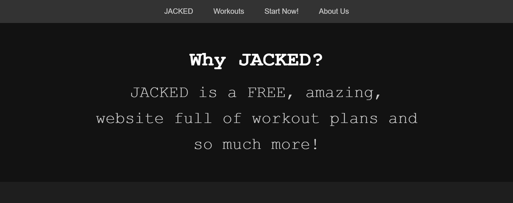
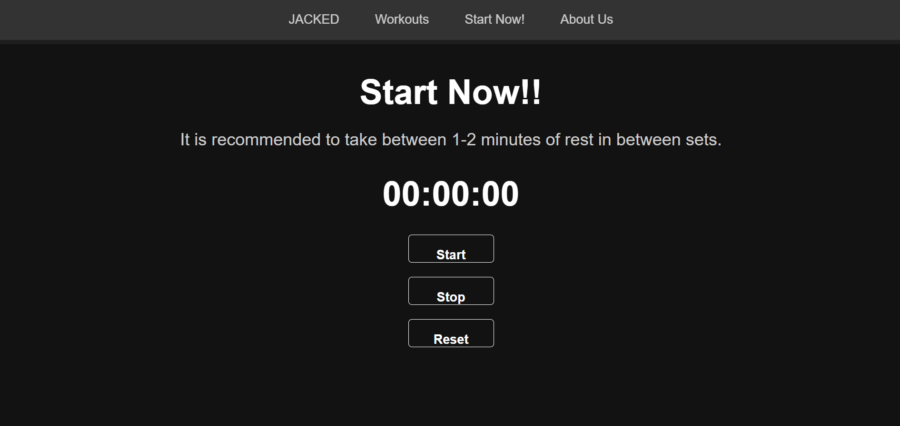
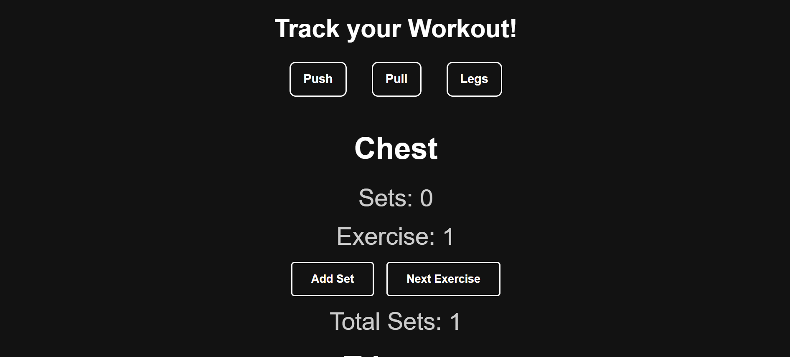

# "JACKED" Website Project

## Overview
"JACKED" is a simple project that provides users with a free workout plan. It additionally showcases a stopwatch and a basic workout tracker.

## Features
- **Concise Workout Split**: Provides users with a structured workout schedule, making it easy to follow.
- **Interactive Stopwatch**: Includes a built-in stopwatch for tracking workout durations. 
- **Interactive Workout Tracker**: Allows users to log their exercises and track their progress.

## Technologies Used
- **Frontend**: HTML, CSS, JavaScript

## Usage
Visit the homepage and explore the available features by navigating through the menu options.

## Screenshots

### Homepage:

### Stopwatch Feature:

### Workout Tracker:

## Roadmap
- **Exercise Tutorials**: Embed videos demonstrating how to perform exercises correctly.
- **Data Storage**: Enable users to have accounts on the website and save user data.
- **Data Export**: Enable users to download workout data, including total time, sets, and exercises, for personal tracking.
- **Progress Sharing**: Allow users to email/upload their progress pictures, which can be featured on the website.

## Contributing
Contributions are welcome! Please open an issue or submit a pull request for any suggestions or changes.

## Contact
For any questions or feedback, please reach out to:
- **Jake Paccione**: jpaccion@stevens.edu
- **Matthew Mohamed**: mmohamed1@stevens.edu
- **Leonard Weber**: lweber2@stevens.edu
